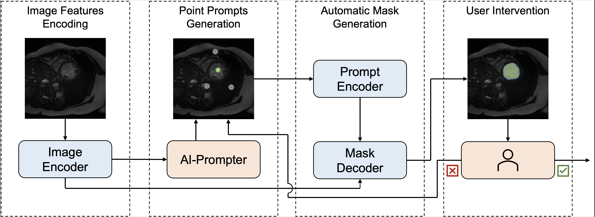

# AI-SAM
Automatic and Interactive Segment Anything Model. When training, this method learn to generate the segmentation masks for each class as well as the corresponing point prompts using only the segmentation masks as the targets. During inference time, AI-SAM automatically generates a set of point prompts and the segmentation masks for each class. To modify the segmentation masks, the user can modify the point prompts. The overall pipeline is below:
 


## Automatic Evaluation

### ACDC
Prepare the dataset following [MT-UNet](https://github.com/Dootmaan/MT-UNet). Then, download the pretrained [weight](.). Finally, you may run the following code to obtain the scores in the paper:
```sh
python eval_one_gpu.py --dataset acdc --use_amp -checkpoint [path-to-the-downloaded-weight] -model_type vit_h --tr_path [path-to-the-dataset-dir] --use_classification_head --use_lora --use_hard_point
```

#### Synapse
Prepare the dataset following [TransUNet](https://github.com/Beckschen/TransUNet/tree/main). Then, download the pretrained [weight](.). Finally, you may run the following code to obtain the scores in the paper:
```sh
python eval_one_gpu.py --dataset synapse --use_amp -checkpoint [path-to-the-downloaded-weight] -model_type vit_h --tr_path [path-to-the-dataset-dir] --use_classification_head --use_lora --use_hard_point
```

## Automatic and Interactive Demo
Refer to [this notebook](automatic_interactive_demo.ipynb) for detail. AI-SAM will first generate a set of foreground and background points base on the class of choice and the user can modify the points base on the segmentation result.

## TODO
1. Add automatic prompt in the interactive demo.
2. Add code for natural images.

## License

This work is licensed under ... license. See for detail.

## Citations
If you find this work useful, please cite:


## Acknowledgements
The code is modified from [MedSAM](https://github.com/bowang-lab/MedSAM/tree/main) and [SAM](https://github.com/facebookresearch/segment-anything). We also used the LoRA implementation from [SAMed](https://github.com/hitachinsk/SAMed/tree/main).
